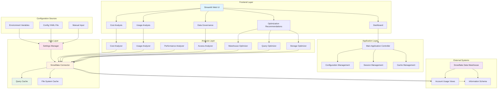

# Snowflake Cost Optimization Platform - Architecture

## Overview

The Snowflake Cost Optimization Platform is a comprehensive data governance and cost optimization solution built with Python and Streamlit. This document outlines the system architecture, design decisions, and data flow patterns.

## Architecture Diagram



## Layer Descriptions

### 1. Frontend Layer
**Technology**: Streamlit
- **Dashboard**: Main overview with key metrics and visualizations
- **Cost Analysis**: Detailed cost breakdown and trends
- **Usage Analysis**: Warehouse utilization patterns
- **Data Governance**: Access patterns and compliance monitoring
- **Optimization Recommendations**: AI-driven optimization suggestions

### 2. Application Layer
**Technology**: Python, Streamlit Session State
- **Main Application Controller**: Central coordination of UI and business logic
- **Configuration Management**: Handles environment variables, YAML config, and manual input
- **Session Management**: Maintains connection state and user session data
- **Cache Management**: Controls query result caching and TTL policies

### 3. Analysis Layer
**Technology**: Python, Pandas, NumPy
- **Cost Analyzer**: Processes billing and credit usage data
- **Usage Analyzer**: Analyzes warehouse utilization patterns
- **Performance Analyzer**: Evaluates query performance metrics
- **Access Analyzer**: Monitors data access patterns for governance
- **Optimizers**: Generate actionable recommendations for cost reduction

### 4. Data Layer
**Technology**: Snowpark Python, Snowflake Connector
- **Snowflake Connector**: Core database connectivity and query execution
- **Query Cache**: File-based caching system with configurable TTL
- **Settings Manager**: Configuration validation and management
- **File System Cache**: Local storage for query results and metadata

### 5. External Systems
**Technology**: Snowflake Data Cloud
- **Snowflake Data Warehouse**: Primary data source
- **Account Usage Views**: Billing, usage, and performance metrics
- **Information Schema**: Metadata about databases, tables, and schemas

## Design Patterns

### 1. Layered Architecture
The application follows a clean layered architecture pattern:
- **Separation of Concerns**: Each layer has distinct responsibilities
- **Dependency Inversion**: Higher layers depend on abstractions, not implementations
- **Single Responsibility**: Components have focused, well-defined purposes

### 2. Repository Pattern
The `SnowflakeConnector` acts as a repository, abstracting data access:
- Centralized query execution
- Dynamic column detection for schema variations
- Consistent error handling and logging

### 3. Strategy Pattern
Different analyzers implement similar interfaces:
- Pluggable analysis strategies
- Consistent data processing patterns
- Easy extensibility for new analysis types

### 4. Factory Pattern
Settings management uses factory patterns:
- Environment-specific configuration creation
- Validation and type checking
- Flexible configuration sources

## Data Flow

### 1. Configuration Loading
```
Environment Variables → Settings Manager ← YAML Config File
                      ↓
                 Snowflake Connector
```

### 2. Query Execution
```
UI Request → Analyzer → Snowflake Connector → Cache Check
                                            ↓
                                      Query Execution
                                            ↓
                                      Cache Storage
                                            ↓
                                      Result Return
```

### 3. Optimization Workflow
```
Raw Data → Usage Analysis → Pattern Recognition → Recommendation Engine
                                                        ↓
                                                 Confidence Scoring
                                                        ↓
                                                 Impact Assessment
                                                        ↓
                                                  UI Presentation
```

## Security Considerations

### 1. Credential Management
- Environment variables for production
- YAML configuration for development
- No hardcoded credentials
- Support for key-pair authentication

### 2. Data Access
- Read-only access to Snowflake
- Minimal required permissions
- Session-based authentication
- Secure connection handling

### 3. Caching Security
- Local file system only
- No sensitive data in cache keys
- Automatic cache expiration
- Manual cache clearing capabilities

## Performance Optimizations

### 1. Query Caching
- Configurable TTL by query type
- MD5-based cache keys
- Automatic expired entry cleanup
- Memory-efficient file-based storage

### 2. Dynamic Column Detection
- Schema-agnostic queries
- Fallback mechanisms for missing columns
- Reduced query failures
- Better cross-environment compatibility

### 3. Lazy Loading
- On-demand data fetching
- Session state persistence
- Minimal initial load time
- Progressive data loading

## Error Handling

### 1. Connection Resilience
- Automatic retry mechanisms
- Graceful degradation
- User-friendly error messages
- Comprehensive logging

### 2. Data Quality
- Null value handling
- Type conversion safety
- Missing column detection
- Data validation

### 3. UI Reliability
- Error boundaries
- Fallback displays
- Progress indicators
- Cache status transparency

## Monitoring and Observability

### 1. Logging
- Structured logging with Loguru
- Configurable log levels
- Error tracking and debugging
- Performance metrics

### 2. Cache Metrics
- Hit rate tracking
- Storage utilization
- Entry lifecycle monitoring
- Performance statistics

### 3. User Experience
- Loading states
- Cache status indicators
- Error notifications
- Help documentation

## Extensibility

### 1. New Analyzers
- Implement base analyzer interface
- Add to factory registration
- Include in UI routing
- Configure caching policies

### 2. Additional Data Sources
- Extend connector interface
- Implement new data adapters
- Add configuration options
- Update security models

### 3. Custom Optimizations
- Inherit from base optimizer classes
- Define recommendation structures
- Implement scoring algorithms
- Add UI presentation logic

## Technology Stack

### Core Technologies
- **Python 3.8+**: Primary programming language
- **Streamlit**: Web UI framework
- **Snowpark Python**: Snowflake connectivity
- **Pandas**: Data manipulation and analysis
- **Plotly**: Interactive visualizations

### Supporting Libraries
- **Pydantic**: Configuration validation
- **Loguru**: Structured logging
- **PyYAML**: Configuration file parsing
- **NumPy**: Numerical computations

### Development Tools
- **pytest**: Unit testing framework
- **GitHub Actions**: CI/CD automation
- **Black**: Code formatting
- **Flake8**: Code linting

## Deployment Considerations

### 1. Environment Setup
- Virtual environment isolation
- Dependency management with requirements.txt
- Environment-specific configurations
- Secret management

### 2. Scaling
- Stateless application design
- Session persistence strategies
- Cache management at scale
- Database connection pooling

### 3. Maintenance
- Automated testing pipelines
- Documentation generation
- Version management
- Security updates 