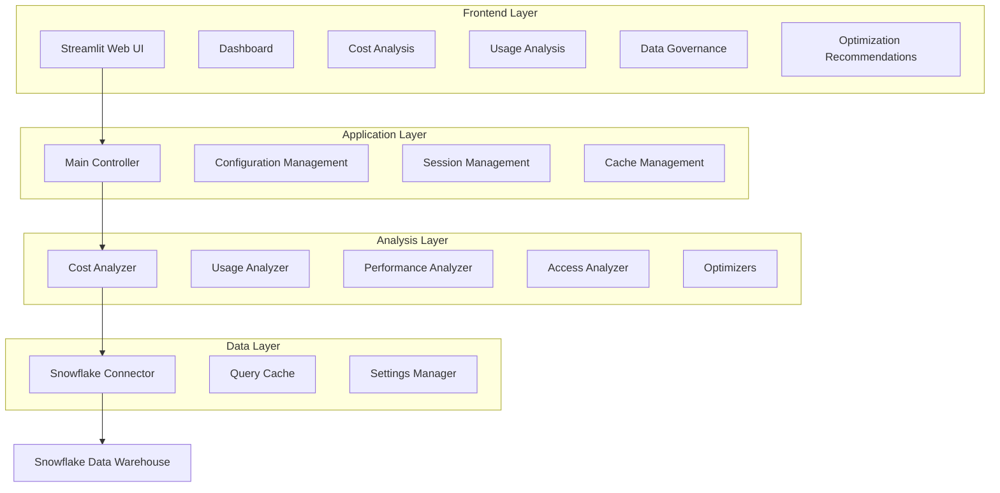

# Snowflake Cost Optimization Platform

Welcome to the **Snowflake Cost Optimization Platform** - an intelligent data governance and cost optimization solution designed to help organizations maximize their Snowflake investment while maintaining optimal performance and compliance.

## Overview

The Snowflake Cost Optimization Platform is a comprehensive Python-based application that provides:

- **Real-time Cost Analysis**: Track and analyze your Snowflake spending patterns
- **Usage Optimization**: Identify underutilized resources and optimization opportunities  
- **Performance Monitoring**: Monitor query performance and warehouse efficiency
- **Data Governance**: Ensure compliance and proper access controls
- **Intelligent Recommendations**: AI-driven suggestions for cost reduction and performance improvement

## Key Features

### 📊 Interactive Dashboard
- Real-time metrics and KPI tracking
- Visual cost breakdowns and trends
- Performance analytics and alerts
- Customizable analysis periods

### 💰 Cost Analysis
- Warehouse credit consumption tracking
- Storage cost optimization
- Historical spending analysis
- Budget forecasting and alerts

### 📈 Usage Analytics
- Warehouse utilization patterns
- Query performance insights
- User access analysis
- Resource efficiency scoring

### 🎯 Optimization Engine
- Warehouse sizing recommendations
- Query optimization suggestions
- Storage cleanup opportunities
- Auto-suspend and scheduling advice

### 🔒 Data Governance
- Access pattern monitoring
- Compliance reporting
- Security anomaly detection
- Privilege analysis

## Quick Start

### Installation

```bash
# Clone the repository
git clone https://github.com/sourabh-virdi/snowflake-cost-optimization.git
cd snowflake-cost-optimization

# Create virtual environment
python -m venv venv
source venv/bin/activate  # On Windows: venv\Scripts\activate

# Install dependencies
pip install -r requirements.txt
```

### Configuration

1. **Environment Variables** (Recommended)
```bash
export SNOWFLAKE_ACCOUNT=your_account_identifier
export SNOWFLAKE_USER=your_username
export SNOWFLAKE_PASSWORD=your_password
export SNOWFLAKE_WAREHOUSE=your_warehouse
export SNOWFLAKE_DATABASE=your_database
export SNOWFLAKE_SCHEMA=your_schema
```

2. **Config File** (Alternative)
```yaml
# config/config.yaml
snowflake:
  account: your_account_identifier
  user: your_username
  password: your_password
  warehouse: your_warehouse
  database: your_database
  schema: your_schema
```

### Launch Application

```bash
streamlit run streamlit_app/main.py
```

Visit `http://localhost:8501` to access the web interface.

## Architecture

The platform follows a clean, layered architecture:



## Technology Stack

- **Backend**: Python 3.8+, Snowpark, Pandas
- **Frontend**: Streamlit, Plotly
- **Database**: Snowflake Data Cloud
- **Caching**: File-based with configurable TTL
- **Configuration**: Pydantic, YAML, Environment Variables
- **Testing**: pytest, Coverage
- **Documentation**: MkDocs, Material Theme

## Performance Features

### Intelligent Caching
- **Query Result Caching**: Reduces Snowflake credit consumption
- **Configurable TTL**: Different cache policies per query type
- **Automatic Cleanup**: Expired entry removal
- **Cache Statistics**: Monitor hit rates and storage usage

### Dynamic Query Building
- **Schema-agnostic**: Adapts to different Snowflake environments
- **Column Detection**: Automatically handles schema variations
- **Fallback Mechanisms**: Graceful handling of missing columns
- **Error Resilience**: Robust error handling and recovery

## Security & Compliance

- **Credential Management**: Multiple secure authentication methods
- **Read-only Access**: Minimal required permissions
- **Data Privacy**: No sensitive data stored in cache keys
- **Audit Trails**: Comprehensive logging and monitoring

## Getting Help

- **Documentation**: [Architecture Guide](ARCHITECTURE.md) | [User Guide](user-guide/dashboard.md)
- **Examples**: Check out the [Getting Started](getting-started/first-steps.md) guide
- **Issues**: Report bugs and feature requests on GitHub
- **Contributing**: See our [Contributing Guide](development/contributing.md)

## License

This project is licensed under the MIT License - see the [LICENSE](../LICENSE) file for details.

## Recent Updates

### Version 1.0.0
- Initial release with comprehensive cost optimization features
- Multi-layer architecture with caching system
- Interactive Streamlit web interface
- Automated testing and CI/CD pipeline
- Complete documentation and deployment guides

---

**Ready to optimize your Snowflake costs?** Start with our [First Steps Guide](getting-started/first-steps.md) or explore the [Interactive Dashboard](user-guide/dashboard.md). 